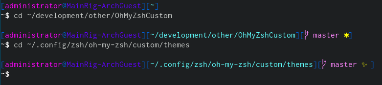

OhMyZshCustom
===========

This repository contains my [OhMyZSH!](https://ohmyz.sh/) 'custom' directory.

It provides:

  * A Custom OhMyZSH Theme

Table of Contents:

* [About](#about)
* [Compiling from Source](#compiling-from-source)
* [Contributing](#contributing)
* [License](#license)

About
-----

[OhMyZSH!](https://ohmyz.sh/) is a configuration framework for the shell [ZSH](https://www.zsh.org/). This repository is my custom shell theme and other associated files. For a usage example, see my [dotfiles](https://github.com/ChristianHering/dotfiles) or OhMyZSH!'s [Overriding and adding themes](https://github.com/ohmyzsh/ohmyzsh/wiki/Customization#overriding-and-adding-themes) page.

Compiling from Source
------------

This directory doesn't contain source code, so there's no need to compile anything. If you'd like to use my theme, simply copy [ch.zsh-theme](themes/ch.zsh-theme) into the custom/themes directory of your [OhMyZSH!](https://ohmyz.sh/) installation or clone this repository and set the ZSH_CUSTOM environment variable.

Contributing
------------

Contributions are always welcome. If you're interested in contributing, send me an email or submit a PR.

License
-------

This project is currently licensed under GPLv3. Please refer to the license file for more information.

